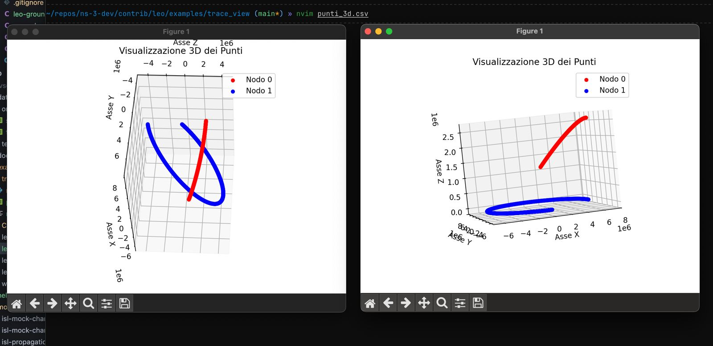
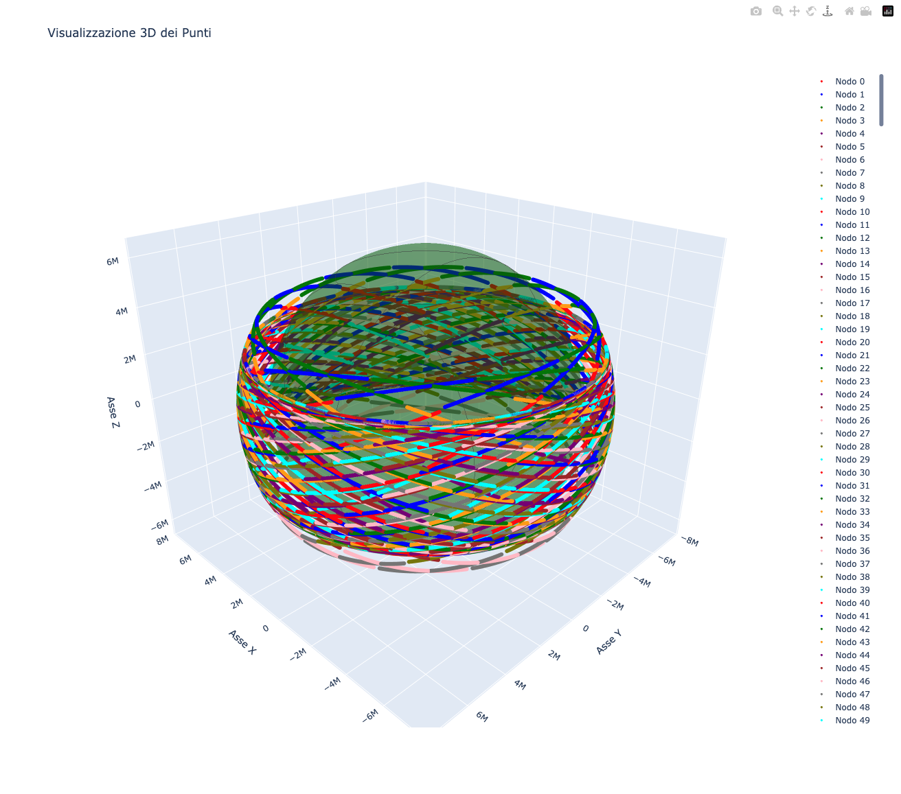
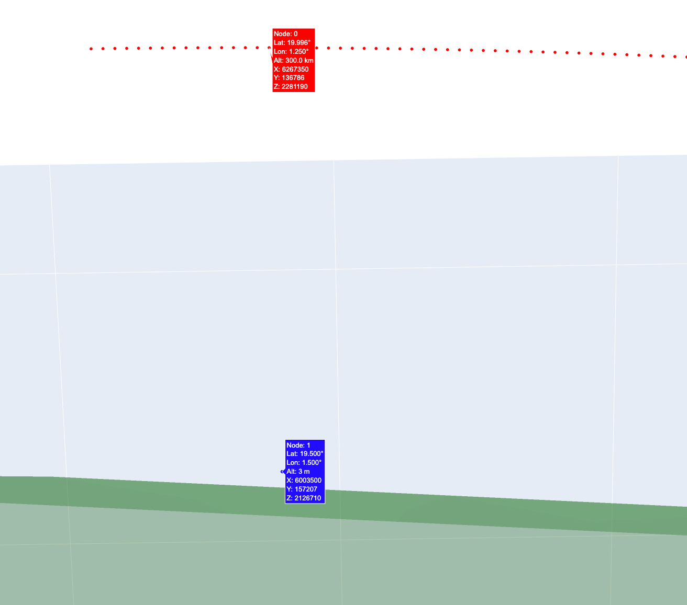

# Adattamento del modulo ns-3 leo

Presa come base per l'implementazione del sistema satellitare abbiamo preso: https://github.com/dadada/ns-3-leo che tuttavia:

- risulta poco aggiornato (non compatibile con le ultime versioni di ns3)
- Manca di alcune feature (oggetto sulla terra a velocità costante)

Pertanto il lavoro fatto è stato:

- cambiare il sistema di build da wscript a cmake, in modo da rendere compatibile il modulo con le ultime versioni di ns3

- diversi bug fix e correzioni nel codice che non rendevano compatibile il modulo con la compilazione tramite clang (più rigoroso sulla sintassi c++ e sul type checking e.g. utilizzo di 0 o NULL al posto di nullptr, incongruenze di tipi)

- cambiate alcune funzioni interne utilizzate (per compatibilità con i nuovi moduli)

- compilato ns-3-leo con nr (5g-lena) sull'ultima versione di ns3

- Implementato un nuovo mobility model che consente di modellare un movimento a velocità costante da una certa posizione (longitudine, latitudine, altezza) verso una direzione (specificando l'azimut) con un determinato modulo, sulla supeficie terrestre, idealizzando la forma del globo ad una semplice sfera, e il movimento dell'oggetto su di essa.

Il nuovo mobility model è stato costruito anche prendendo come modello da cui partire, il ground model già presente per la stazione fissa: [https://github.com/dadada/ns-3-leo/blob/main/helper/ground-node-helper.cc](https://github.com/dadada/ns-3-leo/blob/main/helper/ground-node-helper.cc), ma sopratutto il mobility model del satellite: [https://github.com/dadada/ns-3-leo/blob/main/model/leo-circular-orbit-mobility-model.cc](https://github.com/dadada/ns-3-leo/blob/main/model/leo-circular-orbit-mobility-model.cc) che risultava avere logiche simili, ma un modello di movimento strettamente legato alle orbite, per cui è stato comunque necessaria una riscrittura della maggior parte delle funzioni e delle formule che modellano il movimento.

- Implementato un esempio che traccia i movimenti del nodo veicolo sulla terra a velocità costante e di un satellite, e ne restituisce le coordinate istante per istante

Il mobility model è stato costruito partendo dal seguente esempio: https://github.com/dadada/ns-3-leo/blob/main/examples/leo-circular-orbit-tracing-example.cc e poi adattato allo scenario desiderato.

- Implementazione di uno script python in grado di visualizzare in uno spazio 3d i punti elaborati dall'esempio precedentemente nominato, di modo da visualizzarne graficamente il risultato, tramite matplotlib

- Forkato anche il procetto epidemic-routing per rendere compilabili tutti gli esempi già presenti in ns-3-leo, cambiando anche in questo modulo il build system da wscript a cmake

NOTE finali:

ns-3-leo utilizza un'orbita sferica normalissima che non tiene conto di altri fattori e non è ellittica: ns-3-leo infatti costruisce su ns3 un pianeta sferico al centro delle sue coordinate, e posiziona le varie orbite (e sui vari piani, che non ho ancora compreso cosa sarebbero, su questo chiederei una vosta delucidazione) i vari satelliti equidistanti tra di loro, facendoli muovere ad una velocità calcolata in base all’altitudine su orbite circolari nella direzione prevista dall'orbita stessa.
Diversamente il progetto https://github.com/snkas/hypatia utilizza https://gitlab.inesctec.pt/pmms/ns3-satellite come modulo per il modello per il movimento dei satelliti sulle orbite (che sarebbe SGP4/SDP4 un modello americano, il quale sembrerebbe fare previsioni molto più accurate). Si potrebbe pensare di usare questo modello in sostituzione a quello pre-esistente in ns-3-leo, tuttavia potrebbe essere anche vero che l’approssimazione fatta dallo stesso ns-3-leo potrebbe essere sufficiente per le nostre casistiche.

LINK UTILI:
Dataset satelliti starlink: https://celestrak.org/NORAD/elements/gp.php?GROUP=starlink&FORMAT=csv

# Inizio di implementazione della comunicazione satellite-veicolo con 5g-lena

- Implementando un esempio in ns-3-leo partendo da: https://cttc-lena.gitlab.io/nr/html/cttc-3gpp-channel-example_8cc_source.html e dalla simulazione precedente in modo da iniziare a provare la comunicazione tramite 5g-lena tra un satellite e un veicolo sulla terra, utilizzando il mobility model creato precedentemente.
- Re-Implmenetato il visualizzatore tramite plotly per visualizzare i dati con rendering 3d e GPU-accelerato, in modo da poter visualizzare i dati di movimento del satellite e del veicolo e fare debugging sul funzionamento del mobility model, e della comunicazione tra i due nodi. Visualizzazione interattiva con possibilità di visualizzare latituidine, longitudine e altezza del satellite e del veicolo, e la loro posizione nello spazio 3d.

- Integrazione con i modelli NTN (Non Terrestrial Networks) di ns-3: rimodulazione dei Mobility Model per supportare le coordinate Geocentriche, richieste per l'utilizzo degli scenari NTN, permettendo di conseguenza l'utilizzo di propagation loss 3GPP. L'implementazione è stata realizzata derivando il mobility model GeocentricConstantPositionMobilityModel (maggiori info su [https://www.nsnam.org/workshops/wns3-2023/04-sandri-slides-wns3-2023.pdf](https://www.nsnam.org/workshops/wns3-2023/04-sandri-slides-wns3-2023.pdf)) poichè i controlli all'interno di ns3 vengono effettuati esclusivamente su questa classa (non esiste una classe virtuale per questi modelli) come mostrato qui: [https://www.nsnam.org/doxygen/d5/d46/channel-condition-model_8cc_source.html](https://www.nsnam.org/doxygen/d5/d46/channel-condition-model_8cc_source.html) alla riga 585. Da notare che i metodi utilizzati per il impostazione della posizione non sono funzionanti e richiederebbero l'uso di un MobilityHelper custom che utilizzi i setter della posizione tramite coordinate geocentriche (e non con quelle topocentriche, cioè le coordinate standard).
- Utilizzo dell'esempio [https://www.nsnam.org/doxygen/d7/d09/three-gpp-ntn-channel-example_8cc_source.html](https://www.nsnam.org/doxygen/d7/d09/three-gpp-ntn-channel-example_8cc_source.html) e dell'esempio [https://cttc-lena.gitlab.io/nr/html/cttc-3gpp-channel-example_8cc_source.html](https://cttc-lena.gitlab.io/nr/html/cttc-3gpp-channel-example_8cc_source.html) per la realizzazione di uno scenario con 1 auto e un satellite in comunicazione tramite 5g-lena, utilizzando i mobility model creati precedentemente, e il propagation loss model ThreeGppPropagationLossModel Suburbano (ma personalizzabile).
- Implementato nel LeoOrbitNodeHelper la possibilità di specificare la precisione del modello di movimento, in modo da poter aggiornare la posizione del nodo con una certa frequenza (es. ogni 50ms) e non ogni secondo come avviene di default.
- Implementati dagli esempi precedentemente citati, i metodi per calcolare il SNR tra il satellite e il veicolo, utilizzando le antenne dei dispositivi e il propagation loss model 3GPP, in modo da poter calcolare la qualità del segnale tra i due nodi.
- Integrato nell'esempio con comunicazione tramite nr, più print di debug sulle condizioni di rete e sullo stato della comunicazione, e connesso il gNB sul satellite con un canale PointToPoint ad un nodo di rete utilizzato unicamente per risolvere le problematiche di configurazione di 5g-lena e provare (con successo questa volta) una comunicazione di pacchetti UDP tra il satellite e il veicolo.
- Ristrutturata la gestione del parametro "precision" e lo scheduling degli aggiornamenti della posizione del nodo veicolo e del satellite al fine di risolvere bug di sincronizzazione e renderne la gestione più stabile e coerente evitanto scheduling di eventi non necessari.

